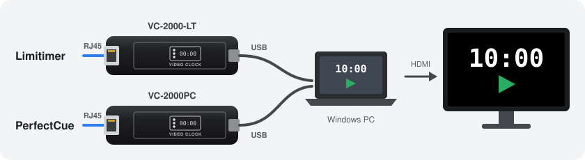

# DSAN Video Clock Display



Full-screen video display of DSAN Limitimer countdowns and PerfectCue Next/Previous
cues, for confidence monitors and stage displays. It reads a VC-2000-LT (Limitimer) and a
VC-2000PC (PerfectCue) at the same time on one PC, so you can show the timer, the cues,
or both.

## Quick start — Windows

1. Download **DSANDisplay-windows-x64.zip** from [Releases](https://github.com/jpkelly/DMAN/releases),
   extract it, and run **DSANDisplay.exe**. Keep the `licenses` folder with it.
2. Close any other software using the dongles, and connect each controller to its
   Limitimer or PerfectCue dongle.
3. Follow the pairing wizard, then select **Save and start inputs**.
4. Check the timer and cues against your controllers, then select
   **Open confidence display**.

Your setup is saved for next time. **Device setup** reopens pairing.

## Using the display

Choose a Limitimer source and program, and add PerfectCue cues if needed.

Select **Open video output**, move the window to your display, and press **F** for
fullscreen. Layout, size, warning, and overtime settings apply live.

Keep the console window open while the show runs. To stop, use **Quit application**
or press **Ctrl+C** in the console.

If a dongle disconnects, the display freezes on the last value and marks it as
disconnected; it does not keep counting down on its own. Reconnect and restart
the app. Moving dongles to different USB ports may require pairing again.

### Other devices on your network

The console prints a network address you can open on another computer or tablet.
There is no login: anyone on the network can change settings or quit the app.
To allow only the host PC:

```bat
DSANDisplay.exe --host 127.0.0.1
```

## Compatibility

Tested with:

- DSAN VC-2000-LT and VC-2000PC USB interfaces
- Limitimer PRO-2000 controller
- PerfectCue Next/Previous from a PerfectCue emulator
- Both interfaces report firmware `Ver 0.17 10/03/14`

Windows 10/11 x64. No vendor software or extra drivers needed. The executable is
unsigned, so Windows may show a warning on first launch. PerfectCue Blank is not
supported.

## More

- [User guide](docs/user-guide.md) — full setup, output settings, and options
- [Third-party notices](docs/third-party.md)

For bug reports, include the app version, OS, controller and dongle models, and
steps to reproduce. Logs are in `%LOCALAPPDATA%\DSANDisplay`; check them for local
device identifiers before sharing.
